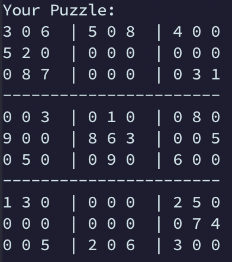
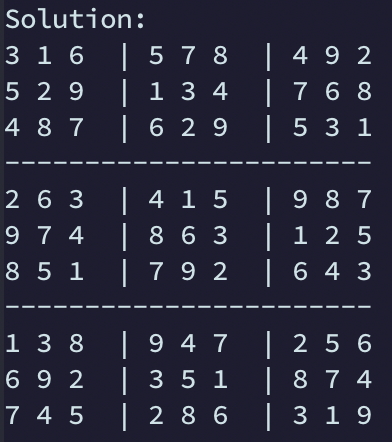

# Sudoku Solver
	
	 Displayed Puzzle      | 	  Solved Puzzle
 | 

**Currently Under Development**

## Main Aims:
- [x] Read base case puzzle in from text file
- [x] Display board before solution is implemented
- [x] Back tracking algorithm that solves the base case puzzle

## Bounus Aims:
- [ ] Puzzle generator

### Side Note
This project has been created for two purposes:
1. Practice Python Coding
2. Learn the Back Tracking Algorithm

_There are plenty of solutions which are much more efficient out there. I'm just using this as a learning opportunity._

